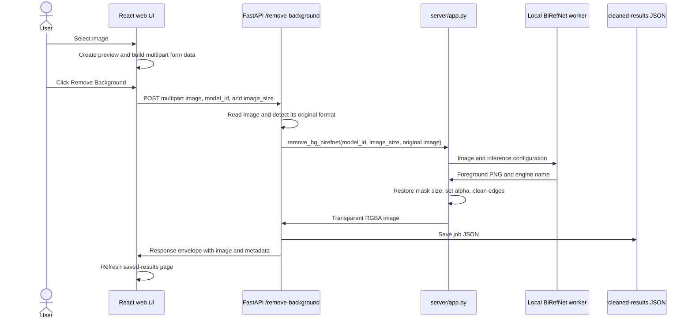

# Background Removal Flow

## System Components

| Component | Responsibility |
| --- | --- |
| `web-ui/src/pages/home/index.tsx` | Accepts an image, uploads it as multipart form data, and refreshes saved results. |
| `server/server.py` | Creates the FastAPI application, configures CORS, and registers the routes. |
| `server/routes.py` | Validates the request, records original-image metadata, invokes background removal, saves the job, and returns the response. |
| `server/app.py` | Preprocesses images, runs the local worker pool, converts the predicted mask into transparency, and cleans the alpha channel. |
| `server/cleaned-results/` | Stores one directory per completed job containing the unchanged original image, cleaned PNG, and JSON record. |

## End-to-End Request Flow



### 1. Upload and client request

1. The upload component returns the first accepted `File` and creates an object URL for its preview.
2. The UI appends the selected file, selected model, and selected inference size to `FormData` using the field names `image`, `model_id`, and `image_size`.
3. The UI sends `POST /remove-background` as `multipart/form-data` with the browser-generated boundary.

```text
Content-Disposition: form-data; name="image"; filename="photo.jpg"
Content-Type: image/jpeg

Content-Disposition: form-data; name="model_id"
ZhengPeng7/BiRefNet_HR-matting
Content-Disposition: form-data; name="image_size"
2048
```

4. While the request is running, the remove button is disabled and displays a spinner.

### 2. API decoding and metadata

The route reads the uploaded bytes and opens the image with Pillow. The original bytes are stored unchanged before inference. It captures:

| Field | Meaning |
| --- | --- |
| `original_image` | URL pointing to the unchanged uploaded image. |
| `original_size` | Uploaded file byte count. |
| `original_bit_depth` | Bit depth inferred from the uploaded image mode. |
| `original_extension` | Original format detected by Pillow. |

The route also generates a collision-resistant `job_id` and records the creation time.

### 3. Inference selection

`remove_bg_birefnet` uses the local BiRefNet worker pool:

1. If every local worker remains busy beyond `BIREFNET_ACQUIRE_TIMEOUT_SECONDS`, return no result instead of waiting indefinitely.
2. If a worker crashes, drops its pipe, returns an error, or exceeds `BIREFNET_TIMEOUT_SECONDS`, replace that worker before it is reused.

The local pool uses round-robin acquisition. Separate processes isolate model execution and allow a failed or timed-out model process to be terminated without terminating FastAPI.

### 4. Image preprocessing

The local path uses this preprocessing:

1. Convert the source to RGB for model input.
2. Use the request's required `image_size` form field, validated between `256` and `2048`.
3. When `BIREFNET_PRESERVE_ASPECT_RATIO=true`, scale the image to fit inside a square canvas without distortion and pad the unused area with `BIREFNET_PAD_COLOR`, defaulting to `(123, 116, 103)`.
4. Otherwise, resize directly to `image_size x image_size`.
5. Convert pixels to a tensor and apply ImageNet normalization:

```text
normalized[channel] = (pixel[channel] / 255 - mean[channel]) / std[channel]
mean = [0.485, 0.456, 0.406]
std  = [0.229, 0.224, 0.225]
```

6. Add a batch dimension to produce `[1, 3, H, W]`.
7. Use FP16 only when `BIREFNET_USE_HALF=true` and the selected device is CUDA.

### 5. BiRefNet inference

The local path runs `AutoModelForImageSegmentation` without gradient tracking, recursively finds prediction tensors in the model output, selects the final prediction, and applies sigmoid:

```text
foreground_probability = sigmoid(final_logits)
```

The prediction is a floating-point mask in `[0, 1]`. Each worker caches the loaded runtime per model/device/image configuration.

### 6. Mask-to-transparent-image postprocessing

1. Convert mask values from `[0, 1]` to an 8-bit grayscale image in `[0, 255]`.
2. If letterboxing was used, crop the mask to remove the padded region.
3. Resize the mask to the original image dimensions with Lanczos interpolation.
4. Convert the original image to RGBA and replace its alpha channel with the predicted mask.
5. Set alpha values below `REMOVE_BG_ALPHA_LOW_THRESHOLD` to `0`; the default is `10`.
6. Set alpha values above `REMOVE_BG_ALPHA_HIGH_THRESHOLD` to `255`; the default is `245`.
7. When smoothing is enabled, smooth only partially transparent edge pixels. Fully transparent and fully opaque pixels remain unchanged.
8. Encode the final image as PNG because PNG preserves per-pixel transparency.

Conceptually, each output pixel is:

```text
output_rgba(x, y) = [original_r, original_g, original_b, round(255 * mask(x, y))]
```

The cleanup thresholds and smoothing modify the final alpha value around that basic result.

### 7. Persistence and response

The API writes each result under `server/cleaned-results/<job_id>/`: `original.<detected-extension>`, `cleaned.png`, and `<job_id>.json`. The JSON record stores image URLs, processing engine, dimensions, sizes, and original-image metadata.

The response is wrapped in the common envelope:

```json
{
  "statusCode": 200,
  "message": "...",
  "data": {
    "job_id": "...",
    "cleaned_image": "http://localhost:8010/cleaned_background_image/.../cleaned.png",
    "engine": "BiRefNet:ZhengPeng7/BiRefNet_HR-matting",
    "width": 1920,
    "height": 1080,
    "bit_depth": 32,
    "size": 123456,
    "original_image": "http://localhost:8010/cleaned_background_image/.../original.jpg",
    "original_size": 234567,
    "original_bit_depth": 24,
    "original_extension": "JPEG"
  }
}
```

After success, the UI requests the first page of `GET /cleaned-backgrounds` so the new item appears in Saved results.

