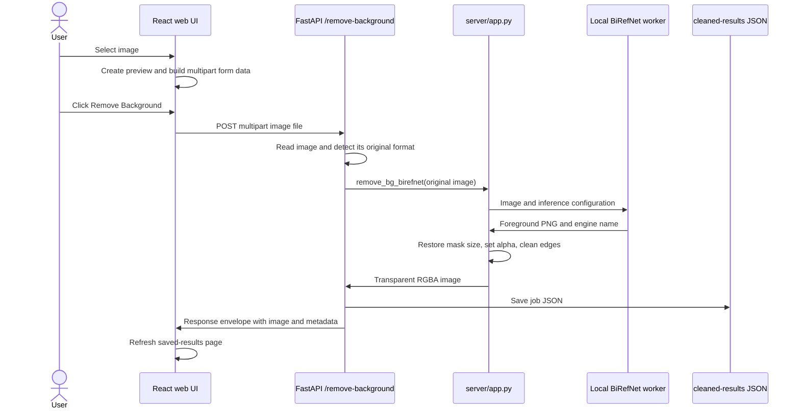

# Background Removal Flow

## System Components

| Component | Responsibility |
| --- | --- |
| `web-ui/src/pages/home/index.tsx` | Accepts an image, uploads it as multipart form data, and refreshes saved results. |
| `server/server.py` | Creates the FastAPI application, configures CORS, and registers the routes. |
| `server/routes.py` | Validates the request, records original-image metadata, invokes background removal, saves the job, and returns the response. |
| `server/app.py` | Preprocesses images, runs the local worker pool, converts the predicted mask into transparency, and cleans the alpha channel. |
| `server/cleaned-results/` | Stores one directory per completed job containing the unchanged original image, cleaned PNG, and JSON record. |

## End-to-End Request Flow



### 1. Upload and client request

1. The upload component returns the first accepted `File` and creates an object URL for its preview.
2. The UI appends the selected file to `FormData` using the field name `image`.
3. The UI sends `POST /remove-background` as `multipart/form-data` with the browser-generated boundary.

```text
Content-Disposition: form-data; name="image"; filename="photo.jpg"
Content-Type: image/jpeg
```

4. While the request is running, the remove button is disabled and displays a spinner.

### 2. API decoding and metadata

The route reads the uploaded bytes and opens the image with Pillow. The original bytes are stored unchanged before inference. It captures:

| Field | Meaning |
| --- | --- |
| `original_image` | URL pointing to the unchanged uploaded image. |
| `original_size` | Uploaded file byte count. |
| `original_bit_depth` | Bit depth inferred from the uploaded image mode. |
| `original_extension` | Original format detected by Pillow. |

The route also generates a collision-resistant `job_id` and records the creation time.

### 3. Inference selection

`remove_bg_birefnet` uses the local BiRefNet worker pool:

1. If every local worker remains busy beyond `BIREFNET_ACQUIRE_TIMEOUT_SECONDS`, return no result instead of waiting indefinitely.
2. If a worker crashes, drops its pipe, returns an error, or exceeds `BIREFNET_TIMEOUT_SECONDS`, replace that worker before it is reused.

The local pool uses round-robin acquisition. Separate processes isolate model execution and allow a failed or timed-out model process to be terminated without terminating FastAPI.

### 4. Image preprocessing

The local path uses this preprocessing:

1. Convert the source to RGB for model input.
2. Use `BIREFNET_IMAGE_SIZE`, defaulting to `1024`.
3. When `BIREFNET_PRESERVE_ASPECT_RATIO=true`, scale the image to fit inside a square canvas without distortion and pad the unused area with `BIREFNET_PAD_COLOR`, defaulting to `(123, 116, 103)`.
4. Otherwise, resize directly to `image_size x image_size`.
5. Convert pixels to a tensor and apply ImageNet normalization:

```text
normalized[channel] = (pixel[channel] / 255 - mean[channel]) / std[channel]
mean = [0.485, 0.456, 0.406]
std  = [0.229, 0.224, 0.225]
```

6. Add a batch dimension to produce `[1, 3, H, W]`.
7. Use FP16 only when `BIREFNET_USE_HALF=true` and the selected device is CUDA.

### 5. BiRefNet inference

The local path runs `AutoModelForImageSegmentation` without gradient tracking, recursively finds prediction tensors in the model output, selects the final prediction, and applies sigmoid:

```text
foreground_probability = sigmoid(final_logits)
```

The prediction is a floating-point mask in `[0, 1]`. Each worker caches the loaded runtime per model/device/image configuration.

### 6. Mask-to-transparent-image postprocessing

1. Convert mask values from `[0, 1]` to an 8-bit grayscale image in `[0, 255]`.
2. If letterboxing was used, crop the mask to remove the padded region.
3. Resize the mask to the original image dimensions with Lanczos interpolation.
4. Convert the original image to RGBA and replace its alpha channel with the predicted mask.
5. Set alpha values below `REMOVE_BG_ALPHA_LOW_THRESHOLD` to `0`; the default is `10`.
6. Set alpha values above `REMOVE_BG_ALPHA_HIGH_THRESHOLD` to `255`; the default is `245`.
7. When smoothing is enabled, smooth only partially transparent edge pixels. Fully transparent and fully opaque pixels remain unchanged.
8. Encode the final image as PNG because PNG preserves per-pixel transparency.

Conceptually, each output pixel is:

```text
output_rgba(x, y) = [original_r, original_g, original_b, round(255 * mask(x, y))]
```

The cleanup thresholds and smoothing modify the final alpha value around that basic result.

### 7. Persistence and response

The API writes each result under `server/cleaned-results/<job_id>/`: `original.<detected-extension>`, `cleaned.png`, and `<job_id>.json`. The JSON record stores image URLs, processing engine, dimensions, sizes, and original-image metadata.

The response is wrapped in the common envelope:

```json
{
  "statusCode": 200,
  "message": "...",
  "data": {
    "job_id": "...",
    "cleaned_image": "http://localhost:8010/cleaned_background_image/.../cleaned.png",
    "engine": "BiRefNet:ZhengPeng7/BiRefNet_HR-matting",
    "width": 1920,
    "height": 1080,
    "bit_depth": 32,
    "size": 123456,
    "original_image": "http://localhost:8010/cleaned_background_image/.../original.jpg",
    "original_size": 234567,
    "original_bit_depth": 24,
    "original_extension": "JPEG"
  }
}
```

After success, the UI requests the first page of `GET /cleaned-backgrounds` so the new item appears in Saved results.

## How BiRefNet Works

BiRefNet means **Bilateral Reference Network**. It performs dichotomous image segmentation: every pixel is assigned a foreground probability, independent of the semantic class of the foreground object. Background removal is an application of that mask, not a separate operation performed inside the neural network.

BiRefNet is organized into a localization module and a reconstruction module. The localization module determines which object is foreground using global context. The reconstruction module progressively restores spatial resolution and fine boundaries. Bilateral reference supplies two complementary signals during reconstruction: original high-resolution image detail flowing inward and gradient-focused boundary attention flowing outward.

### Algorithm

```text
Input image I
    |
    v
Transformer encoder -> hierarchical features at 1/4, 1/8, 1/16, 1/32 scale
    |
    v
Localization module -> global semantics + ASPP multi-scale context
    |
    v
Coarse low-resolution foreground representation
    |
    v
Reconstruction module with repeated BiRef blocks
    |-- Inward reference: original-resolution image patches add fine source detail
    |-- Reconstruction block: hierarchical/deformable receptive fields fuse context
    |-- Outward reference: gradient-aware attention emphasizes detailed boundaries
    |
    v
Progressively higher-resolution predictions
    |
    v
Final one-channel foreground logits -> sigmoid -> probability mask
```

### Localization module

The transformer encoder extracts hierarchical features at progressively lower resolutions. Lateral connections preserve features for later decoder stages. Deep features are combined with global semantic supervision and atrous spatial pyramid pooling (ASPP), allowing the network to recognize a large foreground object while retaining context for smaller structures.

This stage answers the coarse question: **where is the foreground object?**

### Reconstruction module

The decoder progressively upsamples the coarse representation. Each stage combines the previous decoder result with the corresponding encoder feature through a lateral connection. BiRef reconstruction blocks use multiple receptive-field sizes, including `1x1`, `3x3`, and `7x7`, plus adaptive pooling. This balances broad context with local detail.

This stage answers the precise question: **which exact pixels and boundaries belong to the foreground?**

### Inward reference

Downsampling removes thin structures, hair, gaps, and sharp contours. Inward reference restores access to source detail by adaptively cropping the original high-resolution image into patches compatible with each decoder stage and fusing those patches with decoder features.

The direction is "inward" because intact information from the source image is injected into the reconstruction path.

### Outward reference

Outward reference predicts gradient-aware features and converts them into an attention map. The attention weights emphasize regions rich in useful foreground boundaries. A mask derived from intermediate foreground predictions suppresses strong background texture so that arbitrary background edges do not dominate the gradient signal.

The direction is "outward" because reconstructed features produce gradient predictions and attention that guide subsequent refinement.

### Training objective

The original BiRefNet training objective combines complementary supervision:

```text
L = lambda1 * BCE + lambda2 * IoU + lambda3 * SSIM + lambda4 * CE
```

| Loss | Purpose |
| --- | --- |
| BCE | Pixel-level foreground/background correctness. |
| IoU | Region-level overlap and complete object coverage. |
| SSIM | Structural and boundary fidelity. |
| CE | Semantic supervision for stronger localization features. |

Intermediate decoder outputs are also supervised during training. This multi-stage supervision improves convergence and teaches progressively refined predictions. These losses and gradient labels are training-time mechanisms; production inference only executes the learned forward pass and sigmoid.

### Repository-specific model serving

The repository does not implement BiRefNet layers directly. It loads the selected Hugging Face model with `trust_remote_code=True` and wraps it with preprocessing, serving, fallback, and alpha compositing.

## Operational Controls

| Variable | Default | Effect |
| --- | --- | --- |
| `BIREFNET_DEVICE` | Auto | Explicit device; otherwise CUDA when available, then CPU. |
| `BIREFNET_USE_HALF` | `true` | Enables FP16 model inference on CUDA. |
| `BIREFNET_IMAGE_SIZE` | `1024` | Square inference canvas size used by FastAPI preprocessing. |
| `BIREFNET_PRESERVE_ASPECT_RATIO` | `true` | Uses letterboxing instead of geometric distortion. |
| `BIREFNET_PAD_COLOR` | `123,116,103` | RGB value for letterbox padding. |
| `BIREFNET_TIMEOUT_SECONDS` | `120` | Maximum inference duration. |
| `BIREFNET_ACQUIRE_TIMEOUT_SECONDS` | `10` | Maximum wait for a local worker. |
| `BIREFNET_WORKER_POOL_SIZE` | `1` | Number of local inference processes. |
| `REMOVE_BG_ALPHA_CLEANUP_ENABLED` | `true` | Enables alpha thresholding and optional smoothing. |
| `REMOVE_BG_ALPHA_LOW_THRESHOLD` | `10` | Forces low-confidence alpha to transparent. |
| `REMOVE_BG_ALPHA_HIGH_THRESHOLD` | `245` | Forces high-confidence alpha to opaque. |
| `REMOVE_BG_ALPHA_SMOOTH_ENABLED` | `true` | Smooths only partially transparent edges. |

## Sources

- [BiRefNet paper](https://arxiv.org/abs/2401.03407)
- [Official BiRefNet implementation](https://github.com/ZhengPeng7/BiRefNet)
- [Official BiRefNet model card](https://huggingface.co/ZhengPeng7/BiRefNet)
